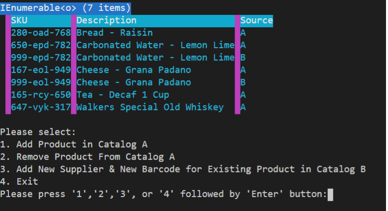

# Coding Skills Challenge

## Instructions
- To use the application you would need to compile the application first

  * `dotnet build`
  * `dotnet run`

- When the compilation is successful, run the application using this command:

  * `dotnet run --project .\codingskills.App\codingskills.App.csproj .\input .\output`

- Once the application is running you would be presented with the Catalog Merging result. To run the other operations, select from option 1 to 4.

